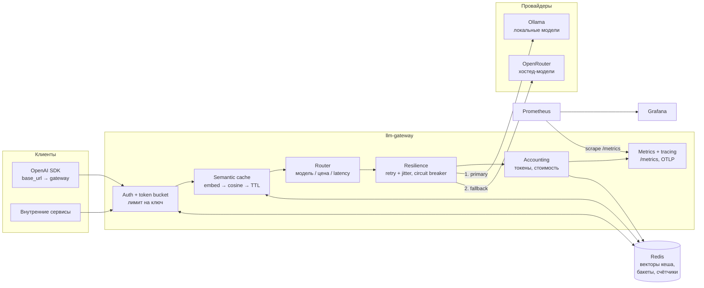

# llm-gateway

Единая OpenAI-совместимая точка входа к нескольким LLM-провайдерам: маршрутизация с
fallback, семантический кеш, лимиты по ключу, учёт токенов и денег, метрики и трейсы.

[](https://github.com/lpogosu/llm-gateway/actions/workflows/ci.yml)


---

## Задача

Как только в компании появляется больше одного сервиса, который ходит в LLM, каждый из
них тащит свой клиент к провайдеру. Дальше всё предсказуемо:

- **Нет видимости расходов.** Счёт от провайдера приходит одной суммой. Кто её сжёг —
  batch-джоб, который переобрабатывает один и тот же корпус, или продовый чат — по счёту
  не видно.
- **Нет кеша.** Одинаковые и почти одинаковые промпты уходят наверх снова и снова.
  Support-бот отвечает на «как сбросить пароль» пятьсот раз в день, и каждый раз это
  полноценная генерация.
- **Нет лимитов.** Один сервис с багом в ретраях выбирает провайдерскую квоту, и падают
  все остальные.
- **Ретраи, backoff и таймауты написаны N раз.** По-разному, обычно без jitter, часто
  ретраят 400-е.
- **Нет трейсов и метрик.** «Latency выросла» — а где именно, у какого провайдера, на
  какой модели, и сколько времени ушло на первый токен, никто не скажет.
- **Смена провайдера — это релиз каждого сервиса.** Даже когда API совместимы.

Шлюз убирает всё это в один сервис, который умеет ровно то, что клиенты уже понимают —
`POST /v1/chat/completions`.

---

## Архитектура



Путь запроса — сверху вниз, и порядок стадий не случайный:

1. **Auth и лимит.** Ключ ищется в конфиге, из его token bucket в Redis списывается
   токен. Лимит стоит **до** кеша: иначе один клиент выбирал бы общий кеш бесплатно и
   вытеснял оттуда чужие ответы.
2. **Кеш.** Промпт эмбеддится, в Redis ищется ближайший вектор в пределах scope. Кеш
   стоит **до** роутинга: попадание не тратит ни одного слота провайдера.
3. **Роутинг.** Правило из `config/routing.yaml` даёт упорядоченную цепочку целей;
   бюджеты клиента (цена, latency) отсекают неподходящие.
4. **Вызов.** По цепочке сверху вниз: circuit breaker решает, стоит ли вообще пробовать,
   ретраи с jitter гасят единичные 429/5xx, отказ переводит на следующую цель.
5. **Учёт.** Токены и деньги пишутся в Redis и в счётчики Prometheus **всегда** — включая
   попадание в кеш (0 USD) и оборванный клиентом стрим.

---

## Что внутри

| Слой | Файлы | Что делает |
|---|---|---|
| HTTP | `app/api/`, `app/schemas.py` | OpenAI-совместимые схемы, SSE, конверт ошибок |
| Пайплайн | `app/service.py` | Порядок стадий, fallback, стриминг, учёт |
| Роутинг | `app/routing/` | Разбор `routing.yaml`, правила, бюджеты, цены |
| Провайдеры | `app/providers/` | `Provider`-протокол, адаптеры Ollama и OpenRouter |
| Кеш | `app/cache/` | Эмбеддинги, косинус, хранение и вытеснение в Redis |
| Лимиты | `app/ratelimit/` | Token bucket на Lua |
| Учёт | `app/accounting/` | Посуточные счётчики по ключу и модели |
| Устойчивость | `app/resilience/` | Backoff с jitter, circuit breaker |
| Наблюдаемость | `app/metrics.py`, `app/tracing.py`, `app/middleware.py` | Prometheus, OTel, JSON-логи с request-id |

---

## Решения и компромиссы

### Семантический кеш вместо точного совпадения

Точный кеш по хешу промпта — это пять строк кода и ноль ложных срабатываний. Он же почти
бесполезен: в живом трафике «Как сбросить пароль?» и «как мне сбросить пароль» — это два
разных ключа, а системный промпт, куда шаблонизатор подставил текущую дату, ломает
совпадение вообще для всего.

Поэтому здесь косинусная близость эмбеддингов. Цена решения названа честно:

- **Ложное попадание — это неправильный ответ пользователю.** Не медленный, не дорогой —
  неправильный. «Как удалить пользователя?» и «Как удалить *всех* пользователей?»
  находятся в пространстве эмбеддингов очень близко, а ответы у них разные. Это главный
  риск конструкции, и он не устраняется полностью, только ограничивается.
- **Ограничения, которые стоят в коде:**
  - порог по умолчанию 0.94 — заметно выше «похоже по теме»;
  - scope: ответ переиспользуется только внутри одной запрошенной модели, одного набора
    параметров сэмплирования и одной модели эмбеддингов
    (`cache_scope()` в `app/cache/semantic.py`) — иначе ответ, сгенерированный при
    `max_tokens=2000`, вернулся бы клиенту с `max_tokens=16`;
  - явная `temperature` выше `cache_max_temperature` (0.2) отключает кеш: клиент попросил
    разнообразие, отдавать ему сохранённый ответ — прямо противоположное действие;
  - заголовок `X-Gateway-Cache-Bypass: true` выключает кеш поштучно и не тратит даже
    вызов эмбеддера;
  - TTL: даже корректное попадание устаревает.
- **Как выбран порог.** 0.94 — это косинус примерно 20°, и это **стартовая точка, а не
  измеренный оптимум**: у каждой модели эмбеддингов своё распределение, и переносить чужое
  число бессмысленно. Поэтому шлюз пишет гистограмму `llm_gateway_cache_similarity` для
  **каждого** поиска, включая промахи. По ней видно реальное распределение своего трафика:
  если масса стоит на 0.97+ — порог занижен и пора его поднимать, если весь трафик под
  0.85 — кеш просто не работает и его дешевле выключить. Настройка порога — это операция
  над данными, а не угадывание в конфиге.
- **Что сознательно не сделано:** нет векторного индекса. Поиск — линейный проход по
  последним `cache_max_candidates` записям внутри scope, один matmul на numpy. Точный,
  без Redis-модулей, предсказуемый на масштабе индекса в пару тысяч записей на scope.
  `SemanticCache` — это ровно тот шов, куда встанет RediSearch или pgvector, когда
  масштаб этого потребует; тащить их заранее — это оплачивать сложность вперёд.

### Token bucket, а не sliding window

Sliding window log точнее: он честно считает «не более N за последние 60 секунд». За это
он платит хранением метки времени каждого запроса и очисткой окна при каждом обращении —
O(N) памяти на ключ.

Token bucket хранит два числа: `tokens` и `updated`. Дальше всё определяется арифметикой
при следующем обращении. Из этого следует и главный компромисс: **bucket разрешает
всплеск на всю ёмкость**. Клиент с `rate_per_second=5, burst=20` может отправить 20
запросов в одну миллисекунду. Для шлюза перед LLM это скорее плюс: батч из 20 запросов —
нормальный паттерн, а провайдер защищён отдельно — своим circuit breaker и таймаутами.

Реализация — один Lua-скрипт (`app/ratelimit/bucket.py`). Не потому что «Lua быстрее», а
потому что refill и списание должны быть атомарны: N реплик шлюза делят один бакет, и
read-modify-write на клиенте здесь — гонка, которая молча раздаёт лишние токены.
Альтернатива на `WATCH/MULTI/EXEC` даёт ту же гарантию за два лишних round-trip на
горячем пути. Дробные токены Lua возвращает строками — RESP-целые обрезали бы дробную
часть, и бакет медленно бы «протекал».

Ключ в Redis — sha256 от API-ключа, а не сам ключ: дамп Redis не должен быть дампом
учётных данных.

### Пороги circuit breaker

Значения по умолчанию: 5 подряд ошибок открывают цепь, 30 секунд восстановления, 2 пробы
в half-open, 2 успешные пробы закрывают.

- **5 подряд, а не «5 из 100».** Одиночная ошибка при живом провайдере — норма, поэтому
  любой успех обнуляет счётчик. Провайдер, который отвечает, не бывает «наполовину
  сломан». Скользящее окно ошибок дало бы более гладкое поведение ценой второго
  состояния, которое надо где-то хранить и объяснять дежурному.
- **30 секунд.** Меньше — и цепь превращается в дорогой способ ретраить. Больше — и
  восстановившийся локальный Ollama простаивает после перезапуска дольше, чем сам
  перезапуск.
- **Состояние — в процессе, не в Redis.** Разделяемый breaker потребовал бы round-trip к
  Redis на каждый вызов провайдера, а одна отравленная реплика (проблемы с сетью только у
  неё) увела бы трафик от здорового провайдера для всего флота. Плата: пороги
  срабатывают на реплику, и при 10 подах провайдер получит до 50 неудачных запросов, а
  не 5. Для fail-fast этого достаточно, а метрика `llm_gateway_circuit_state` показывает
  состояние в разрезе провайдеров.
- **400 от провайдера цепь не открывает.** `ProviderBadRequestError` помечен
  `counts_against_circuit = False`: стена клиентских ошибок не должна выводить исправного
  провайдера из ротации. Такая ошибка ещё и не уходит в fallback — следующая цель
  отвергнет тот же payload, это просто потерянное время клиента.

### Почему OpenAI-совместимый API, а не свой

Свой API был бы чище: не пришлось бы тянуть `object: "chat.completion.chunk"` и
`data: [DONE]`. И он же означал бы, что подключение шлюза — это переписывание каждого
клиента, а откат — ещё одно переписывание. Совместимость означает, что миграция это
одна строка `base_url`, а откат — её же удаление. Ради этого:

- ошибки отдаются в конверте OpenAI (`error.type`, `error.code`), а `RequestValidationError`
  переопределён с 422 на 400 — SDK ждут именно 400;
- стрим — это `chat.completion.chunk` с ролью в первом чанке и `data: [DONE]` в конце;
- расширения шлюза живут **в заголовках**, а не в теле: `X-Gateway-Cache-Bypass`,
  `X-Gateway-Max-Cost-Per-1k`, `X-Gateway-Latency-Budget-Ms` на входе,
  `X-Gateway-Route/Provider/Model/Cache` на выходе. Неизвестные заголовки клиент молча
  игнорирует, неизвестные поля в JSON-теле — нет.

Одно место, где совместимость сознательно нарушена: поля, которые шлюз не может
выполнить, но которые меняют результат (`tools`, `response_format`, `n > 1`), возвращают
400, а не игнорируются. Тихо проигнорировать `tools` — значит вернуть прозу клиенту,
который ждёт вызов функции. Безобидные незнакомые поля (`seed`, `service_tier`)
принимаются: клиентский SDK не должен ломаться о поле, о котором у шлюза нет мнения.

### Стриминг, кеш и учёт

Три неприятных места, все решены явно.

**Fallback возможен только до первого байта.** Как только первый чанк ушёл клиенту,
переключить провайдера честно нельзя — продолжение придёт от другой модели. Поэтому
`open_stream()` вытягивает первое событие *до* того, как отдаются заголовки: пока
статус-строка не отправлена, отказ — это нормальный 503, после — уже нет. Ретраи в
стриминге живут ровно там же: попытку, которая ещё не выдала дельту, можно выбросить,
выдавшую — нельзя.

**Ошибка в середине стрима.** Статус-код уже 200. Менять его некуда, поэтому ошибка едет
в теле — кадром `data: {"error": ...}` и затем `data: [DONE]`. Так делает OpenAI, так это
понимают официальные клиенты; просто закрыть сокет — значит оставить клиент ждать.

**Кеш и стрим.** Попадание отдаётся как стрим — одна дельта плюс завершающее событие.
Границы чанков исходной генерации не сохраняются: хранить их означало бы утроить объём
записи ради визуального эффекта. Клиент, который конкатенирует дельты, разницы не увидит;
клиент, который рисует «печатную машинку», увидит, что текст появился сразу.
Оборванный стрим **не кешируется** — половина ответа не должна стать чужим «полным»
ответом.

**Учёт при обрыве клиента.** `finally` в генераторе выполняется и при обрыве соединения
(FastAPI закрывает генератор, внутри поднимается `GeneratorExit`), поэтому токены,
которые провайдер успел сгенерировать, считаются. Записи в Redis при этом обёрнуты в
`asyncio.shield`: корутина уже находится в отменённом scope, и без shield учёт
оборванного стрима просто терялся бы — а это ровно тот трафик, который никто не замечает.

**Токены на стриме зависят от провайдера.** Ollama кладёт счётчики в финальный чанк
сам; OpenRouter — только если попросить `stream_options.include_usage`, поэтому адаптер
просит всегда. Без этого учёт молча занижал бы каждый стрим-запрос.

### Падение Redis: три разные политики, и это осознанно

Redis нужен трём стадиям сразу, но цена его недоступности у них разная, поэтому одинаковой
политики здесь нет.

| Стадия | Поведение при отказе Redis | Почему так |
|---|---|---|
| Token bucket | **fail closed** — 503 `dependency_unavailable`, запрос наверх не уходит | Без бакета лимит не существует |
| Семантический кеш | **fail open** — промах, запрос идёт к провайдеру | Кеш — оптимизация, а не источник истины |
| Учёт | **fail open с шумом** — ответ отдаётся, потеря счётчика логируется | Ответ уже сгенерирован и оплачен |

**Лимитер — единственное место, где выбран отказ, и это стоит объяснить.** Альтернатива —
fail open — выглядит дружелюбнее: Redis лежит, а трафик идёт. Цена у неё вполне конкретная
и не абстрактная: во время инцидента с Redis у шлюза не остаётся *никакого* механизма
защиты от клиента, который зациклился на ретраях. Провайдерская квота выбирается за
минуты, счёт растёт, а соседние сервисы получают 429 уже от провайдера — то есть ровно та
авария, ради предотвращения которой шлюз и написан. Отказ обслуживания на время недоступности
Redis обратим, а сожжённая квота и счёт — нет, поэтому выбран fail closed.

Смягчается это тремя вещами, а не «клиент подождёт»:

- отказ отдаётся в конверте OpenAI с кодом `dependency_unavailable`, а не голым 500 —
  клиент отличает «шлюз временно не может» от «шлюз сломался»;
- `/health/ready` тоже проверяет Redis и отдаёт 503, так что под уходит из эндпоинтов и
  инцидент виден оркестратору, а не только клиентам;
- у оператора есть явный аварийный рубильник `GATEWAY_RATE_LIMIT_ENABLED=false`: осознанно
  снять лимиты — это решение человека с пониманием последствий, а не поведение по умолчанию
  при сетевом сбое.

Кеш и учёт деградируют молча ровно в том смысле, что запрос не падает; молчания при этом
нет — каждый такой случай виден в `llm_gateway_dependency_errors_total{component}`
(`ratelimit｜cache｜accounting`) и в ERROR/WARNING-логе с `request_id`.

### Прочие решения, за которые стоит отчитаться

- **Своя ASGI-middleware вместо `BaseHTTPMiddleware`.** Базовый класс Starlette
  прогоняет ответ через memory stream, что ломает две вещи, ради которых шлюз и
  существует: отдать токен в момент прихода и заметить, что клиент отключился.
- **Свой retry вместо `tenacity`.** Нужны три вещи, которых готовый декоратор не даёт:
  `Retry-After` от провайдера должен побеждать нашу кривую (но не превышать `max_delay` —
  иначе один заголовок вешает запрос на минуты), sleep и RNG должны инжектиться, чтобы
  тесты проверяли точные задержки, и каждый ретрай должен быть виден в метрике.
- **Кардинальность меток.** В Prometheus уходит `owner` ключа, а не сам ключ, и модель,
  которую выбрал роутер, а не строка от клиента. Шлюз стоит перед произвольными
  клиентами — это первое место в платформе, где взрывается кардинальность.
- **`decode_responses=False` для Redis.** В Redis лежат упакованные float32-векторы;
  один клиент в bytes-режиме и явное декодирование в точке использования честнее, чем
  два клиента с разными настройками.
- **Ollama не входит в `docker-compose.yml`.** Ей нужны GPU и десятки гигабайт кеша
  моделей; поднимать это как часть демо-стека — обман. Она подключается по URL, а если
  недоступна — маршрут уходит в fallback.

### Где шлюз сознательно не помогает

Честный список того, что он **не** делает, потому что «шлюз для всего» — это способ не
сделать ничего хорошо:

- **Не делает семантически неверный ответ верным.** Если модель ошиблась, шлюз
  закеширует ошибку. Оценка качества — не его слой.
- **Не даёт мультиплексирования GPU.** Три реплики шлюза перед одним Ollama не ускорят
  один Ollama. Очередь и батчинг — задача рантайма модели.
- **Не защищает от prompt injection и не фильтрует контент.** Модерация, PII-редакция,
  guardrails — отдельная ответственность; впихнуть их сюда означало бы делать их плохо.
- **Не поддерживает tool calling, structured outputs и `n > 1`.** Не «пока не», а
  «возвращает 400»: полусырая поддержка вызова функций хуже её отсутствия.
- **Не хранит историю диалогов.** Он stateless между запросами; контекст присылает клиент.
- **Не заменяет квоты провайдера.** Лимит на ключ защищает соседей по шлюзу, а не ваш
  аккаунт у провайдера.
- **Не делает breaker распределённым** и не делает лимит на *токены* модели вместо
  запросов: сколько токенов съест запрос, до вызова неизвестно, а оценивать — значит
  выдумывать число, по которому кого-то отключат.

---

## Метрики и бенчмарки

Все цифры ниже получены запуском `scripts/bench.py` против реально работающего шлюза и
воспроизводятся командами из этого раздела. **Они измеряют шлюз, а не модель**: наверху
стоит `scripts/stub_upstream.py` — заглушка с Ollama-совместимым API и настраиваемой
задержкой. Реальная генерация занимает секунды и полностью скрыла бы то, что тратит сам
шлюз.

Стенд: Windows 11, Python 3.11.9, Redis 7.4 в Docker, шлюз и заглушка на loopback,
uvicorn в один процесс без воркеров. Абсолютные значения зависят от машины; смысл имеют
разницы между строками.

**Накладные расходы шлюза** (последовательно, 60 запросов, заглушка отвечает мгновенно):

| Путь | p50 | p95 |
|---|---|---|
| Напрямую в заглушку | 1.18 ms | 1.37 ms |
| Через шлюз, кеш выключен заголовком | 5.02 ms | 6.78 ms |
| Через шлюз, попадание в кеш | 7.61 ms | 8.68 ms |

То есть ~3.8 ms на запрос за auth, token bucket в Redis, роутинг, вызов и учёт. Ещё
~2.6 ms добавляет кеш: обращение к эмбеддеру плюс поиск вектора.

**Кеш при реалистичной модели** (заглушка с задержкой 800 ms, 400 запросов,
конкурентность 32, 10% уникальных промптов):

| Режим | Throughput | p50 | p95 | Попаданий |
|---|---|---|---|---|
| Кеш выключен | 32.5 req/s | 831 ms | 902 ms | 0 / 400 |
| Кеш включён | 89.8 req/s | 153 ms | 901 ms | 361 / 400 |

**Тот же сценарий, но модель отвечает мгновенно** (1000 запросов, конкурентность 32):

| Режим | Throughput | p50 |
|---|---|---|
| Напрямую в заглушку | 224.9 req/s | 102 ms |
| Через шлюз, кеш выключен | 199.9 req/s | 109 ms |
| Через шлюз, кеш включён | 115.6 req/s | 223 ms |

Вывод, который стоит проговорить, потому что он неудобный: **семантический кеш — это не
бесплатное ускорение**. Он выигрывает 2.8× по throughput перед моделью с задержкой 800 ms
и **проигрывает** перед моделью, которая отвечает за миллисекунду: обращение к эмбеддеру
и поиск вектора дороже самой генерации. Порог окупаемости — примерно та же величина, что
и стоимость поиска: если p50 модели меньше ~10 ms, кеш надо выключать
(`GATEWAY_CACHE_ENABLED=false`). Для любой настоящей LLM это условие выполняется с
огромным запасом, но конфигурация, которая может быть вредной, должна быть названа.

Воспроизвести:

```bash
docker run -d --name bench-redis -p 6379:6379 redis:7.4-alpine
python scripts/stub_upstream.py --port 11500 --delay-ms 800 --tokens 32 &

GATEWAY_REDIS_URL=redis://127.0.0.1:6379/0 \
GATEWAY_OLLAMA_BASE_URL=http://127.0.0.1:11500 \
GATEWAY_EMBEDDING_BASE_URL=http://127.0.0.1:11500 \
GATEWAY_API_KEYS='{"sk-local-dev":{"owner":"dev","rate_per_second":5000,"burst":5000}}' \
python -m uvicorn app.main:create_app --factory --port 8080 &

python scripts/bench.py --requests 400 --concurrency 32 --no-cache
python scripts/bench.py --requests 400 --concurrency 32 --unique 0.1
```

Тесты: **162 проходят**, покрытие **91%** (`make test`).

---

## Быстрый старт

```bash
cp .env.example .env       # заполнить GATEWAY_API_KEYS, при желании OpenRouter
make up                    # шлюз + Redis + Prometheus + Grafana
```

Ожидаемо:

```
gateway    http://localhost:8080
prometheus http://localhost:9090
grafana    http://localhost:3000 (anonymous viewer)
```

Проверка:

```bash
$ curl -s localhost:8080/health/ready
{"status":"ok","checks":{"redis":"ok","circuit:ollama":"closed"}}

$ curl -s -H "Authorization: Bearer sk-local-dev" localhost:8080/v1/models
{"object":"list","data":[{"id":"fast","object":"model","created":1788740475,"owned_by":"fast-local"},
{"id":"gpt-3.5-turbo","object":"model","created":1788740475,"owned_by":"general"}, ...]}
```

Первый запрос — промах кеша, второй — попадание:

```bash
$ curl -si -X POST localhost:8080/v1/chat/completions \
    -H "Authorization: Bearer sk-local-dev" -H 'Content-Type: application/json' \
    -d '{"model":"gpt-3.5-turbo","messages":[{"role":"user","content":"What is a message queue?"}]}' \
  | grep -i '^x-gateway'
x-gateway-route: general
x-gateway-provider: ollama
x-gateway-model: llama3.1:8b
x-gateway-cache: miss

# тот же запрос ещё раз
x-gateway-route: general
x-gateway-provider: ollama
x-gateway-model: llama3.1:8b
x-gateway-cache: hit
x-gateway-cache-similarity: 1.0000
```

Учёт:

```bash
$ curl -s -H "Authorization: Bearer sk-local-dev" localhost:8080/v1/usage
{"object":"usage","owner":"dev","start":"2026-09-01","end":"2026-09-07","total_requests":3,
 "total_tokens":108,"total_cost_usd":0.0,
 "data":[{"provider":"ollama","model":"llama3.1:8b","requests":3,"cache_hits":1,
          "prompt_tokens":12,"completion_tokens":96,"total_tokens":108,"cost_usd":0.0}]}
```

`make demo` прогоняет весь этот сценарий целиком — включая стрим, отказ по бюджету
latency и упор в token bucket до 429.

Существующий клиент подключается сменой одной строки:

```python
from openai import OpenAI

client = OpenAI(base_url="http://localhost:8080/v1", api_key="sk-local-dev")
client.chat.completions.create(
    model="gpt-3.5-turbo",
    messages=[{"role": "user", "content": "Привет"}],
)
```

---

## API

| Метод | Путь | Назначение |
|---|---|---|
| `POST` | `/v1/chat/completions` | Совместимо с OpenAI, streaming и non-streaming |
| `GET` | `/v1/models` | Имена моделей, которые принимает шлюз (из правил роутинга) |
| `GET` | `/v1/usage` | Токены и стоимость по вызывающему ключу, `?start=&end=` |
| `GET` | `/health/live` | Liveness: проверяет только процесс |
| `GET` | `/health/ready` | Readiness: Redis плюс состояние цепей |
| `GET` | `/metrics` | Prometheus |
| `GET` | `/docs` | OpenAPI UI |

Заголовки запроса:

| Заголовок | Значение |
|---|---|
| `Authorization: Bearer <key>` | Обязателен для `/v1/*` |
| `X-Gateway-Cache-Bypass: true` | Не искать в кеше и не тратить эмбеддинг |
| `X-Gateway-Max-Cost-Per-1k: 0.001` | Отсечь цели дороже, по худшей цене (input/output) |
| `X-Gateway-Latency-Budget-Ms: 2500` | Отсечь цели с бо́льшим p95 из каталога |
| `X-Request-ID` | Пробрасывается в логи и ответ; иначе генерируется |

Заголовки ответа: `X-Gateway-Route`, `X-Gateway-Provider`, `X-Gateway-Model`,
`X-Gateway-Cache` (`hit｜miss｜bypass｜skipped｜error｜disabled`),
`X-Gateway-Cache-Similarity`, `X-Request-ID`, `Retry-After` при 429.

---

## Конфигурация

Секреты и всё, что зависит от окружения — через переменные окружения с префиксом
`GATEWAY_` (см. `.env.example`). Модельный ландшафт — в `config/routing.yaml`.

| Переменная | По умолчанию | Смысл |
|---|---|---|
| `GATEWAY_API_KEYS` | `{}` | JSON: ключ → `{owner, rate_per_second, burst}`. `owner` попадает в метки метрик, ключ — нет |
| `GATEWAY_REDIS_URL` | `redis://localhost:6379/0` | Кеш, бакеты, счётчики |
| `GATEWAY_ROUTING_CONFIG_PATH` | `config/routing.yaml` | Таблица маршрутов и цен |
| `GATEWAY_OLLAMA_BASE_URL` | `http://localhost:11434` | Локальный рантайм |
| `GATEWAY_OPENROUTER_API_KEY` | — | Пусто ⇒ провайдер не регистрируется, его маршруты пропускаются |
| `GATEWAY_OPENROUTER_BASE_URL` | `https://openrouter.ai/api/v1` | |
| `GATEWAY_CACHE_ENABLED` | `true` | Выключать, если модель быстрее поиска по кешу |
| `GATEWAY_CACHE_SIMILARITY_THRESHOLD` | `0.94` | Порог косинуса. Настраивать по `llm_gateway_cache_similarity` |
| `GATEWAY_CACHE_TTL_SECONDS` | `3600` | TTL записи и индекса |
| `GATEWAY_CACHE_MAX_CANDIDATES` | `64` | Сколько последних векторов scope сканировать |
| `GATEWAY_CACHE_INDEX_SIZE` | `2000` | Верхняя граница индекса на scope |
| `GATEWAY_CACHE_MAX_TEMPERATURE` | `0.2` | Выше — кеш не применяется |
| `GATEWAY_EMBEDDING_BASE_URL` | `http://localhost:11434` | Эмбеддер (`/api/embed`) |
| `GATEWAY_EMBEDDING_MODEL` | `nomic-embed-text` | Входит в scope: смена модели изолирует старые векторы |
| `GATEWAY_EMBEDDING_TIMEOUT_SECONDS` | `5` | Короткий: кеш не должен стоить дороже вызова |
| `GATEWAY_RATE_LIMIT_ENABLED` | `true` | |
| `GATEWAY_REQUEST_TIMEOUT_SECONDS` | `60` | Таймаут запроса к провайдеру |
| `GATEWAY_CONNECT_TIMEOUT_SECONDS` | `5` | Таймаут соединения |
| `GATEWAY_RETRY_MAX_ATTEMPTS` | `3` | Попыток на одну цель |
| `GATEWAY_RETRY_BASE_DELAY_SECONDS` | `0.2` | Основание экспоненты |
| `GATEWAY_RETRY_MAX_DELAY_SECONDS` | `5` | Потолок, в том числе для `Retry-After` |
| `GATEWAY_RETRY_JITTER` | `1.0` | 1.0 — full jitter, 0.0 — детерминированная кривая |
| `GATEWAY_BREAKER_FAILURE_THRESHOLD` | `5` | Подряд идущих отказов до открытия |
| `GATEWAY_BREAKER_SUCCESS_THRESHOLD` | `2` | Успешных проб до закрытия |
| `GATEWAY_BREAKER_RECOVERY_SECONDS` | `30` | Окно до half-open |
| `GATEWAY_BREAKER_HALF_OPEN_MAX_CALLS` | `2` | Одновременных проб |
| `GATEWAY_USAGE_RETENTION_DAYS` | `90` | TTL суточных счётчиков |
| `GATEWAY_LOG_LEVEL` | `INFO` | |
| `GATEWAY_OTEL_ENABLED` | `false` | Включает экспорт спанов по OTLP |
| `GATEWAY_OTEL_ENDPOINT` | `http://localhost:4317` | |

### `config/routing.yaml`

```yaml
version: 1

catalog:                       # что вообще существует, почём и как быстро
  - provider: ollama
    model: llama3.1:8b
    input_cost_per_1k_usd: 0.0
    output_cost_per_1k_usd: 0.0
    p95_latency_ms: 3500

routes:                        # правила сверху вниз, побеждает первое совпавшее
  - name: general
    match:
      models: [gpt-3.5-turbo, llama3.1:8b]
    targets:                   # упорядоченная цепочка fallback, не пул балансировки
      - provider: ollama
        model: llama3.1:8b
      - provider: openrouter
        model: meta-llama/llama-3.1-8b-instruct
```

Порядок правил задаётся файлом, а не «специфичностью паттерна»: правило «выигрывает
самое специфичное» — это ровно та магия, из-за которой дежурный не может объяснить, куда
ушёл трафик. Конфиг валидируется при старте: неизвестная цель, дубль имени маршрута или
чужая версия — это падение на старте, а не 500 в проде.

---

## Метрики

| Метрика | Тип | Что показывает |
|---|---|---|
| `llm_gateway_requests_total{route,provider,model,outcome}` | counter | Запросы по исходу: `success`, `cache_hit`, `aborted`, `exhausted` |
| `llm_gateway_request_duration_seconds{route,provider,model}` | histogram | Полное время от входа до последнего байта; бакеты растянуты до 90 s |
| `llm_gateway_time_to_first_token_seconds{provider,model}` | histogram | Задержка до первой дельты стрима |
| `llm_gateway_tokens_total{provider,model,kind}` | counter | Токены, `kind=prompt｜completion` |
| `llm_gateway_cost_usd_total{owner,provider,model}` | counter | Расход по прайсу из `routing.yaml` |
| `llm_gateway_cache_lookups_total{result}` | counter | `hit｜miss｜bypass｜skipped｜error｜disabled`; hit ratio считается отсюда |
| `llm_gateway_cache_similarity` | histogram | Близость лучшего кандидата — и при попадании, и при промахе. Инструмент подбора порога |
| `llm_gateway_dependency_errors_total{component}` | counter | Отказы Redis по месту: `ratelimit｜cache｜accounting` |
| `llm_gateway_provider_errors_total{provider,kind}` | counter | `timeout｜unavailable｜rate_limited｜bad_request｜protocol｜circuit_open` |
| `llm_gateway_provider_retries_total{provider}` | counter | Ретраи после отказа, который можно повторить |
| `llm_gateway_circuit_state{provider}` | gauge | 0 closed, 1 half-open, 2 open |
| `llm_gateway_circuit_transitions_total{provider,to_state}` | counter | Переходы цепи |
| `llm_gateway_rate_limit_rejections_total{owner}` | counter | 429 от token bucket |
| `llm_gateway_upstream_inflight{provider}` | gauge | Вызовы провайдера в полёте |

Дашборд Grafana (`config/grafana/dashboards/llm-gateway.json`) поднимается вместе со
стеком; правила алертов — `config/alerts.yml`.

Логи — построчный JSON с `request_id`, `owner`, `route`, `provider`, `model`,
`duration_ms` и `trace_id`, когда трейсинг включён.

---

## Разработка

```bash
make install     # pip install -e ".[dev]"
make lint        # ruff
make typecheck   # mypy --strict app
make test        # pytest с покрытием
make ci          # всё сразу, как в пайплайне
```

Тесты не требуют сети и запущенных сервисов: Redis — `fakeredis` (включая настоящее
выполнение Lua-скрипта token bucket), провайдеры — сценарные фейки из `tests/fakes.py`,
HTTP-адаптеры — `respx` поверх транспорта httpx. Проверяется поведение:

- маршрутизация — порядок правил, glob-паттерны, отсечение по цене и latency, валидация
  конфига;
- token bucket — всплеск на всю ёмкость, дозаправка, потолок ёмкости, `Retry-After`,
  изоляция ключей, TTL, сохранение дробных токенов;
- circuit breaker — все переходы, ограничение проб в half-open, перезапуск окна после
  неудачной пробы, сброс счётчика при успехе;
- retry — точные задержки при заданном RNG, приоритет `Retry-After`, отказ от ретрая 400;
- кеш — холодный старт, порог сверху и снизу (19° против 21°), выбор ближайшего из
  нескольких, изоляция scope, TTL, вытеснение, исчезнувшая запись, смена размерности
  вектора, отказ эмбеддера;
- стриминг — кадры SSE, обрыв клиента с закрытием upstream и досчётом токенов, ошибка
  в середине стрима, кешируемый повтор, отказ кешировать оборванный стрим;
- деградация — подставной Redis, в котором падает каждая команда: 503 на лимитере,
  нормальный ответ с `X-Gateway-Cache: error` при мёртвом кеше, нормальный ответ при
  мёртвом учёте.

---

## Деплой

```bash
helm upgrade --install gw charts/llm-gateway \
  --set secrets.existingSecret=llm-gateway-secrets \
  --set config.redisUrl=redis://redis-master:6379/0
```

В чарте: Deployment (probes, `readOnlyRootFilesystem`, non-root uid 10001, preStop-пауза
под rolling update), Service, Ingress с выключенной буферизацией — иначе ingress
собирает весь стрим и отдаёт одним куском, HPA, PDB, ConfigMap с таблицей маршрутов и
контрольной суммой в аннотации пода, ServiceMonitor и шаблон Secret, который по
умолчанию **не** рендерится: в настоящем кластере ключи приходят из внешнего секрет-менеджера.

---

## Лицензия

MIT — см. [LICENSE](LICENSE).
